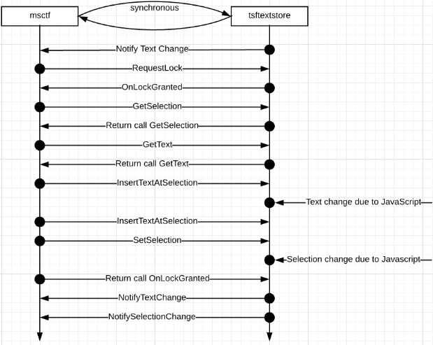
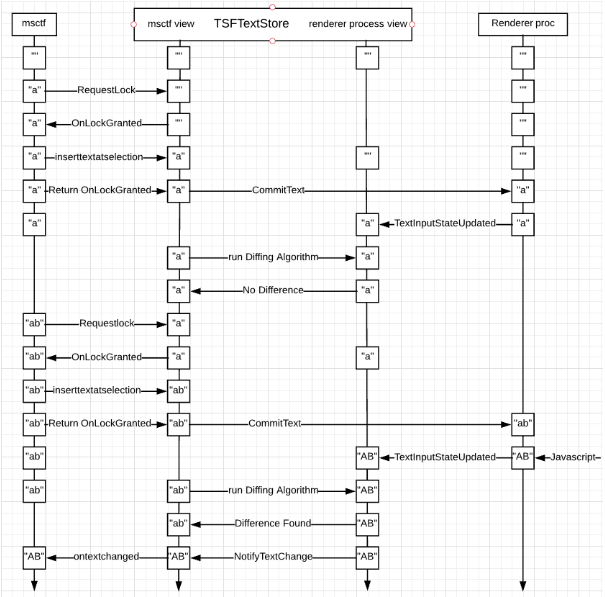

# TSF1.0 Design Document

## Overview
This document provides an overview of Anaheim project support for TSF1.0 framework, which allows IMEs to update content on a webpage through Windows Input Service. TSF1.0 framework also provides text intelligence features that were not previously available in IMM32.

## Architecture Overview
Supporting TSF1.0 framework doesn’t require architectural changes to Chromium. At high level, TSF1.0 implementation in Anaheim project lives in browser process and communicates with Windows Input Service via several COM interfaces. The TSF1.0 counterpart in browser process communicates with renderer process through TextInputClient interface which is platform agnostic.  

The implementation in browser process is called TSFTextStore. It implements ITextStoreACP, ITfContextOwnerCompositionSink, ITfTextEditSink and ITfKeyTraceEventSink. TSFTextStore is created when the browser process launches for the first time through the text store manager (TSFBridgeImpl). The TSFTextStore object is shared among all text controls of same type on the UI thread. 

TSF1.0 support contains three main components. Windows Input Service, TSF1.0 implementation in browser process, and TextInputClient which represents edit control in renderer process. Since renderer process can only communicate with browser process via IPC message mechanism, which is asynchronous, we need to maintain an Input Service’s view of the cached text for the current edit control in focus. The cache is stored in TSFTextStore. Windows Input Service directly works with the maintained cache synchronously. When browser process receives an IPC message from renderer process to update the cached text/selection/layout, we will run an algorithm to determine the difference between our cached text/selection/layout with updated text/selection/layout and notify Windows Input Service about the change. When Windows Input Service wants to modify text/selection in edit control, TSFTextStore uses TextInputClient interface to modify the edit control asynchronously. 

To show the relationship between each component, please read the following sections for a more detailed design. 

 
## Detailed Design

### TSFTextStore creation and lifetime: 

When the browser process launches for the first time, it calls BrowserMainRunnerImpl::Initialize  to initialize the main thread and other things like the main message loop, OLE etc. In this function, ui::InitializeInputMethod() is called which is a static method that initializes the TSFBridgeImpl (a TLS implementation of TSFBridge). TSFBridgeImpl is created for a specific window handle and lives in the thread environment block of the UI thread. TSFBridgeImpl::Initialize method CoCreates the thread manager instance and then initializes the DocumentMapInternal through InitializeDocumentMapInternal API.

TSFBridgeImpl::InitializeDocumentMapInternal API has a document-to-TSFTextStore map based on text input type of the text input client(in TSF1.0 it’s the RenderWidgetHostViewAura). It creates a TSF text store for a text input type. This text input type can have the below values:

* TEXT_INPUT_TYPE_NONE
* TEXT_INPUT_TYPE_TEXT
* TEXT_INPUT_TYPE_PASSWORD
* TEXT_INPUT_TYPE_SEARCH
* TEXT_INPUT_TYPE_EMAIL
* TEXT_INPUT_TYPE_NUMBER
* TEXT_INPUT_TYPE_TELEPHONE
* TEXT_INPUT_TYPE_URL 

### TSFTextStore post creation:

Now TSFTextStore is successful registered with Windows Input Service and is ready to receive function calls to modify content in edit control. Right after the edit control is in focus, TSFTextStore will hold a reference to the view (RenderWidgetHostViewAura), which implements TextInputClient interface. TSFTextStore uses TextInputClient interface to get updated text/selection/layout information of focused edit control. Under the hood, the information of edit control is stored in TextInputState struct in browser process. The struct lives in TextInputManager object which is owned by the view (RenderWidgetHostViewAura). When text/selection/layout is changed in edit control in renderer process, an IPC message will be sent to browser process to update the TextInputState struct.

When TSFTextStore receives function calls from Windows Input Service to insert text, change selection, complete composition, etc. TSFTextStore uses TextInputClient interface to do operations (delete a range, insert text, commit composition, etc) in renderer process. As soon as the IPC message reaches renderer process, InputMethodController is the object to do the work.

### graphical explainer to the design

The communications between Windows Input Service(msctf.dll) and TSFTextStore are all synchronous. The contract is that once the Input Service view of the edit control’s document is locked (during OnLockGranted callback), the document should not be modified. Hence, we come up with following design:

In the design, even though DOM tree is modified due to Javascript interuption during the lock, we won’t notify Windows Input Service about any change immediately after the change. Instead, we calculate the difference and notify input service accordingly after the lock has been released. The TextInputState struct which is cached in the view from browser process is being constantly updated from renderer process for any text/selection/layout change. We check the updated TextInputState struct with our cached view of edit control, if any difference is found meaning text/selection/layout change is initialized from renderer process, then we will send notifications to input service.

The communication between TSFTextStore and renderer process are asynchronous. TSFTextStore is un-aware of any DOM operations, therefore all DOM related operations have to go through TextInputClient interface. We cache the Windows Input Service's view of edit control in TSFTextStore. We uses the cached view to compare with TextInputState cache and calculates the text/selection that need to be changed in edit control and use TextInputClient to do the work after the lock has been released.

The diagram below shows the detailed design that messages go from Windows Input Service(msctf.dll) to renderer process through TSFTextStore. Function calls between msctf.dll and TSFTextStore are synchronous. Function calls between TSFTextStore and renderer process are asynchronous. Each rectangle indicates the text view of corresponding processes. For TSFTextStore, the left column is the Windows Input Service’s cached view of edit control, the right column is the TextInputState struct cache.

 

The diagram below shows one complete cycle of IME composition with more complicated scenario. Given the nature of async communication, we should not work on the TextInputState cache until it’s updated.

In the design, we run the diffing algorithm after Windows Input Service completes the composition. However, the TextInputState struct in browser process hasn't been updated yet. We should not use the stale TextInputState struct to do the comparision. Instead, We run the diffing algorithm again after the TextInputState struct has been successfully updated and determines that there are changes in the edit control other than the change initialized by the Windows Input Service. We calculate the difference and notify Windows Input Service about the change initialized from renderer process.

## Links to relevant frameworks

* [Text Services framework](https://docs.microsoft.com/en-us/windows/desktop/TSF/text-services-framework)
* [TSF1.0 framework](https://docs.microsoft.com/en-us/windows/desktop/api/_tsf/)

## Appendix

* [Related Class Hierarchy](RelatedClassHierarchy.md)
* [Message Communications Between Components](MessageCommunications.md)
