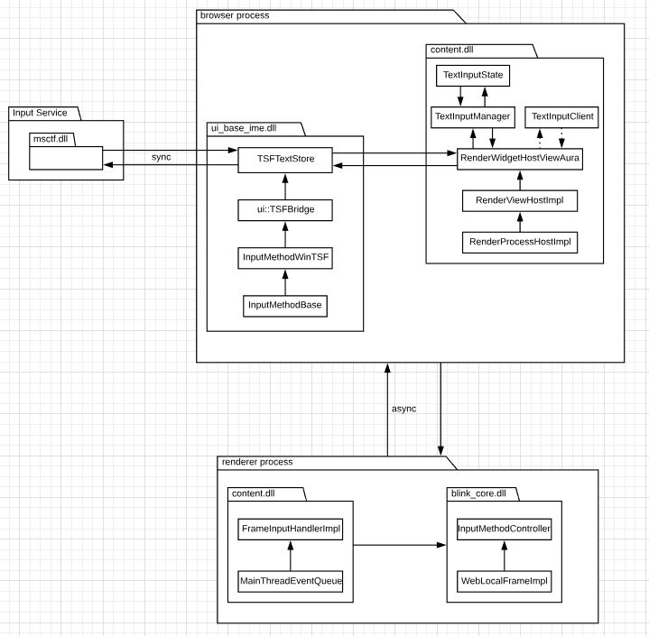

# TSF1.0 Design Document

## Overview

### Summary

This document provides an overview of TSF1.0 framework support for Chromium, which allows IMEs to update content on a webpage through Windows Input Service. TSF1.0 framework also provides text intelligence features such as on-screen keyboard input suggestions, shape-writing in on-screen keyboard, customized on-screen keyboard UI for different types of edit control, that were not previously available in IMM32. Current Chromium project already have TSF1.0 support, however, the implementation is not complete and it's disabled by default. This design doc provides detailed design to implement full TSF1.0 support in Chromium.

### Platforms

Only for Window Desktop platform.

### Code affected

The development will be done in content.dll and ui_base_ime.dll, both dlls live in browser process.

## Architecture Overview

Supporting TSF1.0 framework doesn’t require architectural changes to existing Chromium project. Current Chromium project already have basic TSF1.0 implementation. The implementation lives in browser process and communicates with Windows Input Service via several COM interfaces. It communicates with renderer process through TextInputClient interface which is platform agnostic. The pattern to use TextInputClient interface for communications with blink is shared for all platforms. The detailed design section below only extend the existing implemention to fully support TSF1.0 framework.

For current TSF1.0 support in Chromium project, there are three main components. Windows Input Service, TSF1.0 implementation in browser process, and TextInputClient which represents edit control in renderer process. When browser process launches for the first time and TFS1.0 support is enabled, TSFTextStore, which implements ITextStoreACP, ITfContextOwnerCompositionSink, ITfTextEditSink and ITfKeyTraceEventSink interfaces provided by Windows Input Service, is created by TSFBridgeImpl, which is the manager of TSFTextStore, for each input type. Once TSFTextStore is successfully registered with Windows Input Sercice, it's ready to receive function calls to modefiy content in edit control. Windows Input Service uses TSFTextStore to query for editing context in blink in order to do operations such as insert text, change selection, update composition, etc. 

When the browser process launches for the first time, it calls `BrowserMainRunnerImpl::Initialize` to initialize the main thread and other things like the main message loop, OLE etc. In this function, `ui::InitializeInputMethod` is called which is a static method that initializes the TSFBridgeImpl (a TLS implementation of TSFBridge). TSFBridgeImpl is created for a specific window handle and lives in the thread environment block of the UI thread. `TSFBridgeImpl::Initialize` method CoCreates the thread manager instance and then initializes ITfContexts for each TextInputType through `TSFBridgeImpl::InitializeDocumentMapInternal` API. The API also creates a document-to-TSFTextStore map based on TextInputType of the TextInputClient (implemented by RenderWidgetHostViewAura). It creates a TSFTextStore for each TextInputType, which can have following values:

* TEXT_INPUT_TYPE_NONE
* TEXT_INPUT_TYPE_TEXT
* TEXT_INPUT_TYPE_PASSWORD
* TEXT_INPUT_TYPE_SEARCH
* TEXT_INPUT_TYPE_EMAIL
* TEXT_INPUT_TYPE_NUMBER
* TEXT_INPUT_TYPE_TELEPHONE
* TEXT_INPUT_TYPE_URL 

Once TSFTextStore is successful registered with Windows Input Service, it is ready to receive function calls to modify content in edit control. Right after the edit control is in focus, TSFTextStore will hold a reference to the view (RenderWidgetHostViewAura), which implements TextInputClient interface. Since TSFTextStore doesn't cache any editing context of focused edit control, Windows Input Service gets empty text and selection of (0,0) after querying for the editing context from TSFTextStore. TSFTextStore uses TextInputClient interface to do operations (delete a range, insert text, commit composition, etc) in renderer process. As soon as the mojo message reaches renderer process, InputMethodController is the final object to do the work.

Here is a graphical view of the architecture between each components:

For more detailed architecture overview, please see [communication between components](MessageCommunications.md) and [related class hierarchy](RelatedClassHierarchy.md).

## Issue with current TSF1.0 implementation and proposed mitigation design

The issue of current TSF1.0 implementation is that TSFTextStore doesn't have any knowledge of editing context for focused edit controls. Windows Input Service needs to know context of focused edit control. However, current design of TSFTextStore doesn't provide any editing context of focused edit control except during IME composition. Therefore, Windows Input Service doesn't have any knowledge of the edit context of edit control outside of active composition. The focused edit control is always empty with selection of (0,0) from Windows Input Service's perspective. New IME composition is always started at (0,0) because TSFTextStore always reports empty buffer in the edit control. TSFTextStore also sends text change notification to Windows Input Service to clear the buffer after the IME composition has been committed. This issue blocks Windows Input Service from providing full functionality of text intelligence features such as on-screen keyboard suggestions. Korean IME cannot do reconversion on already-committed text due to this same issue. The detailed design section below is focused on addressing this issue.

In order to address the issue mentioned above, TSFTextStore needs to be aware of editing context of focused edit control. The editing context of the focused edit control is stored in TextInputState struct in browser process. The struct lives in TextInputManager object which is owned by the view (RenderWidgerHostViewAura). When editing context is changed in edit control, a mojo message is sent to browser process to update the TextInputState struct. The context cached in TextInputState is always same as the context in focused edit control. TSFTextStore can obtain the editing context of focused edit control from TextInputState struct and notify Windows Input Service with the context.

## Detailed design

After enabling TSFTextStore to be aware of existing editing context, we also need to maintain an Input Service’s view of the editing context for focused edit control because renderer process can only communicate with browser process via mojo communication asynchronously. The cache is stored in TSFTextStore. Windows Input Service directly modifies the maintained cache because TSFTextStore communicates with Windows Input Service synchronously. Windows Input Service uses TSFTextStore to do editing operations in focused edit control, and TSFTextStore uses TextInputClient interface to modify the edit control asynchronously. The DOM operation may trigger additional javascript calls which may modify DOM tree as well. Any context change in the focused edit control will trigger a mojo communication between renderer process and browser process to update TextInputState struct. When TextInputState is updated from renderer process, we run an algorithm to determine the difference between our cached editing context with updated editing context in edit control. The difference will be the additional change not triggered by Windows Input Service, therefore, we notify Windows Input Service about the change.

### Graphical explainer for the design

The communications between Windows Input Service(msctf.dll) and TSFTextStore happens on the UI thread of browser process and all communications are synchronous. The contract is that once the Input Service's view of context in edit control is locked (during OnLockGranted callback), the view of context should not be modified by components other than msctf.dll. One complete locking period is considered as one entire edit session. Hence, we come up with following design:

In the design, even though DOM tree is modified due to Javascript interuption during the lock, we won’t notify Windows Input Service about any change immediately to prevent reentrancy. Instead, we calculate the difference and notify input service accordingly after the lock has been released. The TextInputState struct which is cached in browser process is being constantly updated from renderer process for any context change in edit control. We check the updated TextInputState struct with our cached context of edit control, if any difference is found meaning any text/selection/layout change is initialized from renderer process, then we will send notifications to input service.

Windows Input Service(msctf.dll) can do editing operations during each edit session. Since the communication between TSFTextStore and renderer process are asynchronous and the communications between msctf.dll and TSFTextStore are synchronous, we update the msctf.dll's view of edit control right after TSFTextStore receives function calls form msctf.dll. After the lock has been release, we now use the cached view to compare with TextInputState struct and calculate the text/selection that need to be changed in edit control and use TextInputClient to do the work.

The diagram below shows the detailed design that messages go from msctf.dll to renderer process through TSFTextStore. Function calls between msctf.dll and TSFTextStore are synchronous. Function calls between TSFTextStore and renderer process are asynchronous. Each rectangle indicates the text view of corresponding processes. For TSFTextStore, the left column is the msctf.dll’s cached view of edit control, the right column is the TextInputState struct.

 

The diagram below shows one complete cycle of IME composition with more complicated scenario. Given the nature of async communication, we should not work on the TextInputState cache until it’s updated.

In the design, we run the diffing algorithm after Windows Input Service completes the composition. However, the TextInputState struct in browser process hasn't been updated yet. We should not use the stale TextInputState struct to do the comparision. Instead, We run the diffing algorithm again after the TextInputState struct has been successfully updated and determines that there are changes in the edit control other than the change initialized by the Windows Input Service. We calculate the difference and notify Windows Input Service about the change initialized from renderer process.

### Racing conditions and solutions

First racing condition happens within TSFTextStore. When we run diffing algorithm after each edit session, there may be a case where the msctf.dll's cached view is different from TextInputState struct. For example, initial text buffer of the focused edit control is "12" and selection is (1,1). msctf.dll tries to insert "a" during one edit session and the cached view in TSFTextStore is "1a2". However, when "a" is inserted into DOM tree, javascript changes the buffer in edit control to "3b4". When we run the algorithm to determine the change after the lock is released, cached view's "1a2" is different from TextInputState's "3b4". In this case, the editing context in TextInputState always take precedency. We notify msctf.dll about context change with TextInputState's context.

Second racing condition happens due to the asynchronous mojo communication between browser process and renderer process. There may be a case where the current edit session has ended but the TextInputState hasn't been updated yet. In this case we shouldn't use stale TextInputState struct to run diffing algorithm. We should wait and run the algorithm until the TextInputState is updated. The solution is also illustrated in the graphical explainer above.

### Trade-offs with proposed design

For TSF1.0 Support, it would be ideal if we can create TSFTextStore for each edit control that is editable and provide full editing context to Windows Input Service. However, browser process has no knowledge about DOM element concept and TSFTextStore lives inside browser process. TSFTextStore cannot be created for each edit control in current Chromium architecture. Therefore, TSFTextStore objects are created based on the predefined INPUT types and each input type shares the TSFTextStore object.

In order to achieve 1 to 1 relationship between TSFTextStore and edit control, we need to modify existing Chromium architecture to expose edit control to browser process. Such effort will affect all platforms. By following the existing architecture, we re-use TSFTextStore when focus switches from first edit control to second edit control with same predefined input type. the cached context in TSFTextStore is changed to the context of the second edit control. When the focus switches back to the first edit control, the context cached in TSFTextStore is changed back to the context of the first edit control.

No text intelligence features are affected because we re-populate the context of the edit control everytime the edit control is in focus. The down-side is that we need to notify msctf.dll about the context change everytime focus switches from one edit control to another.

## Performance

We expect the TSF1.0 support will have similar performance as the IMM32 support on Windows platform because both implementations use same TextInputClient interface to achieve editing outcomes. We will add telemetry logs to TSF1.0 implementations to compare the performance with IMM32.

## Testing plan

There are unit tests written for TSFTextStore. We will add more test cases as well. The unit test cases are thorough and including edge case handlings. We also do manual testing by installing popular IMEs on all Windows platforms and test it on popular editing sites.

## Implementation and Shipping Plan

There is already a feature flag for TSF1.0 support. Once the implemenation is done and manual testing is complete, we can turn on the feature flag by default.

## Links to relevant frameworks

* [Text Services framework](https://docs.microsoft.com/en-us/windows/desktop/TSF/text-services-framework)
* [TSF1.0 framework](https://docs.microsoft.com/en-us/windows/desktop/api/_tsf/)

## Appendix

* [Related Class Hierarchy](RelatedClassHierarchy.md)
* [Message Communications Between Components](MessageCommunications.md)
