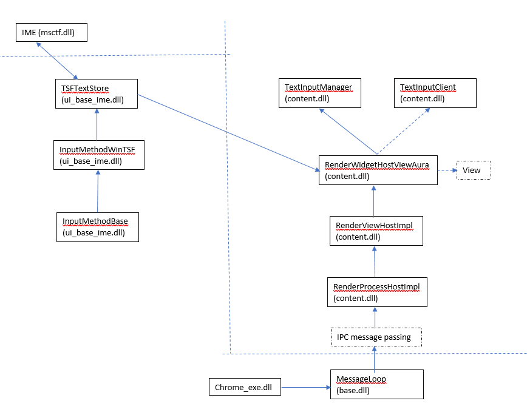
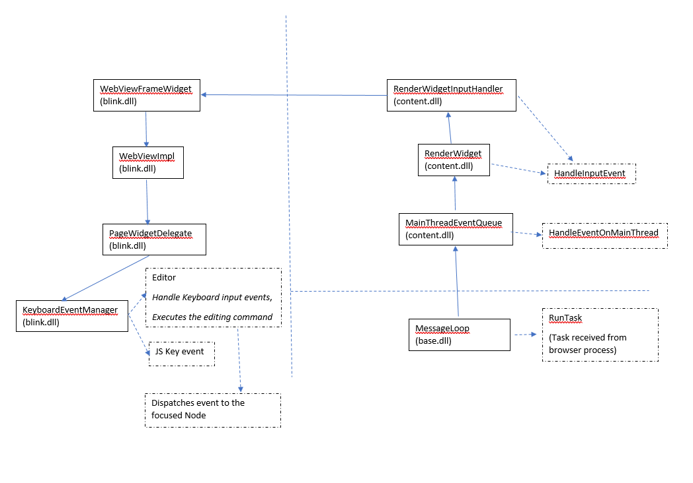
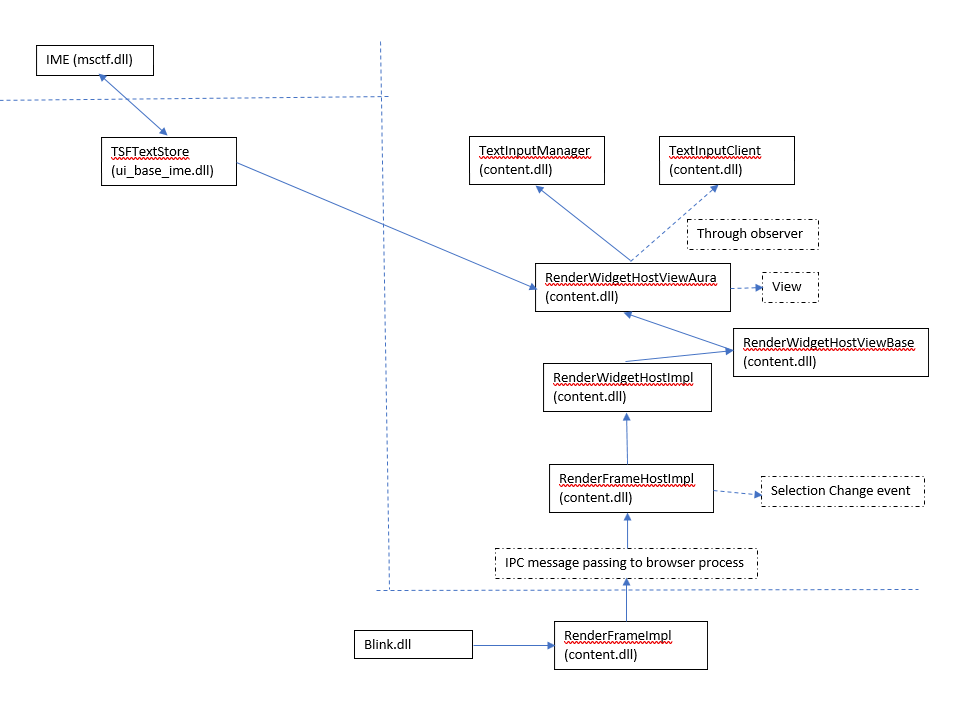

# This document shows several charts regarding message flows among different components

## IME message communication in Windows Input Service and Browser Process

## Input message communication in Renderer Process and Browser Process

## selection change message flow from Renderer Process to Browser Process to Windows Input Service

