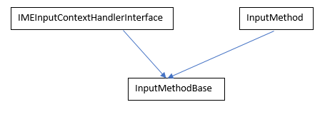
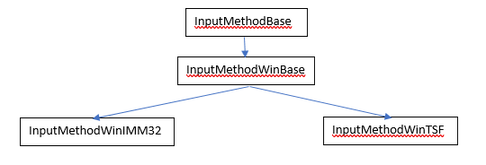

# Related class hierarchy for TSF1.0 design

## For ALL OS

* IMEInputContextHandlerInterface:
This interface has some common APIs that are used to inform the text input engine does some operation such as commit a text, update the composition text, delete the surrounding text, sending key events etc.

* InputMethod:
An interface implemented by an object that encapsulates a native input method service provided by the underlying operating system, and acts as a "system wide" input method for all Chrome windows. A class that implements this interface should behave as follows:

  * Receives a keyboard event directly from a message dispatcher for the system through the InputMethod::DispatchKeyEvent API, and forwards it to an underlying input method for the OS.
  * The input method should handle the key event either of the following ways:

    1. Send the original key down event to the focused window, which is e.g. a NativeWidgetAura (NWA) or a RenderWidgetHostViewAura (RWHVA), using internal::InputMethodDelegate::DispatchKeyEventPostIME API, then send a Char event using TextInputClient::InsertChar API to a text input client, which is, again, e.g. NWA or RWHVA, and then send the original key up event to the same window.
    2. Send VKEY_PROCESSKEY event to the window using the DispatchKeyEvent API, then update IME status (e.g. composition text) using TextInputClient,  then send the original key up event to the window.

  * Keeps track of the focused TextInputClient to see which client can call APIs, OnTextInputTypeChanged, OnCaretBoundsChanged, and CancelComposition, that change the state of the input method. In Aura environment, aura::WindowTreeHost creates an instance of ui::InputMethod and owns it.

* InputMethodBase overrides methods from InputMethod and IMEInputContextHandlerInterface that are used to set focus/blur on a text input client, send ui keys events, notify text input state changed, update composition texts etc. Currently below are the classes that inherits from InputMethodBase:
  1.  InputMethodAuraLinux: Linux input method editor
  2.  InputMethodMinimal: Minimal implementation that only has direct input without any compositions or conversions.
  3.  InputMethodMus: Input method editor implementation of MUS. MUS stands for Mandoline UI Service
  4.  InputMethodChromeOS: ChromeOS input method editor implementation
  5.  InputMethodWinBase: Windows input method editor implementation

## For Windows OS

For Windows OS, InputMethodWinBase is used as a common InputMethod base implementation.

* Browser Process:
  * InputMethodWinIMM32: IMM32 based input method editor.
  * InputMethodWinTSF: TSF1.0 based input method editor.
  * TSFBridge: TSFBridge provides high level IME related operations on top of Text Services Framework (TSF). TSFBridge is managed by TLS because TSF related stuff is associated with each thread and not allowed to access across thread boundary. To be consistent with IMM32 behavior, TSFBridge is shared in the same thread. TSFBridge is used by the web content text inputting field, for example DisableIME() should be called if a password field is focused. TSFBridge also manages connectivity between TSFTextStore which is the backend of text inputting and current focused TextInputClient. All methods in this class must be used in UI thread.
  * TSFBridgeImpl (TLS implementation of TSFBridge)
  * TSFTextStore: TSFTextStore is used to interact with the input method via TSF manager.
  * TextInputClient: It is the interface that is implemented by a view that needs text input support. 
  * RenderWidgetHostViewAura: It is the text input client that TSF1 uses to fetch the text range, update text input state, delete a range, insert text etc.

* Renderer Process:
  * InputMethodController is a final class that is created using LocalFrame. This class has APIs to interact with DOM, selection controllers, “visible” range in the plain text view of the DOM etc. It also facilitates composition that is platform agnostic. It uses generic structure to represent the range of the selection, composed text (ImeTextSpan) etc.

  Ex: When input service calls SetText in the browser process, an IPC message is sent to the renderer process (in the main thread) to insert a composed text. InputMethodController::SetComposition function is called that computes the “visible” selection from the DOM tree, updates styles, dispatches composition events to JS etc.
